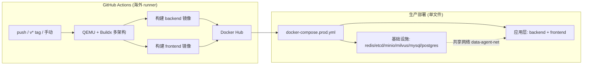

## 产品概述

基于项目实际代码结构，优化 Docker 打包发布体系，实现镜像自动构建并发布到 Docker Hub，同时提供「一条命令全量部署」的生产编排能力。

## 核心需求

1. **修复海外构建隐患**：`backend/pyproject.toml` 第 48-50 行的 `[[tool.uv.index]]` 指向清华 PyPI 源，导致 GitHub Actions 海外 runner 拉依赖慢/可能失败，需在 Dockerfile 中覆盖为官方源。
2. **单文件全量部署**：将现有 `docker-compose.yml` 中的 7 个基础设施服务（redis/etcd/minio/milvus/mysql/postgres）合并进 `docker-compose.prod.yml`，保留 volume 持久化、init-scripts 挂载、healthcheck、共享网络，实现 `docker compose -f docker-compose.prod.yml up -d` 一条命令拉起全部服务。
3. **镜像版本参数化**：当前 prod 文件硬编码 `:latest`，需支持 `IMAGE_TAG` 环境变量（默认 latest），便于发布正式版本时指定具体版本号。
4. **优化 GitHub Action**：保持「每次 push 都发 + tag 触发 + 手动触发」策略，优化缓存、并发控制与稳定性（当前实际工作流文件是 `.github/workflows/docker-image.yml`，非历史记忆中的 `docker-publish.yml`）。
5. **提供 3 个可选发布方案**：单文件 compose（默认落地）、多 compose 分层、纯 buildx 脚本，附对比与适用场景，供后续按需切换。

## 技术栈

- **编排**：Docker Compose（单文件 `docker-compose.prod.yml`）
- **CI/CD**：GitHub Actions + docker/build-push-action@v6 + docker/metadata-action@v5 + QEMU + Buildx
- **镜像仓库**：Docker Hub（`${DOCKERHUB_USERNAME}/data-agent-backend` 与 `/data-agent-frontend`）
- **后端镜像**：`python:3.12-slim` + `uv`（依赖管理）
- **前端镜像**：多阶段 `node:20-alpine`（构建）→ `nginx:alpine`（托管，SSE 关闭缓冲）

## 实现方案

### 架构设计

采用「单仓库双镜像 + 单文件全量编排」策略：



### 关键决策与理由

**1. 修复清华源问题（backend/Dockerfile）**
`pyproject.toml` 的 `[[tool.uv.index]]` 是 `default=true`，会覆盖所有依赖下载源。GitHub Actions 的 ubuntu runner 在海外，访问清华源 `pypi.tuna.tsinghua.edu.cn` 慢且可能超时。方案：在 Dockerfile 中通过环境变量覆盖，无需修改 pyproject.toml（保留国内开发者的本地加速）：

```
ENV UV_DEFAULT_INDEX=https://pypi.org/simple
```

该变量优先级高于 `pyproject.toml` 的 `[[tool.uv.index]]`，仅影响镜像构建，不影响本地开发。

**2. 单文件全量部署（docker-compose.prod.yml）**
把基础设施 7 个服务 + 应用 2 个服务合并，镜像 tag 参数化：

```
backend:
  image: ${DOCKERHUB_USERNAME}/data-agent-backend:${IMAGE_TAG:-latest}
```

保留 7 个 named volumes、init-scripts 挂载、healthcheck、`data-agent-net`（driver bridge + name，与后端容器名 `backend` 保持一致以配合 nginx 反代 `http://backend:8000`）。

**3. GitHub Action 优化**

- 保持 `push branches [data_agent_pro]` + `tags v*` + `workflow_dispatch`
- 保留多架构 `linux/amd64,linux/arm64`、gha 缓存
- 增加 `concurrency` 组避免并发 push 导致镜像 tag 冲突
- 保留 metadata-action 的 tag 策略（sha 短哈希用于每次 push，latest 仅 tag 时生成）

### 目录结构

```
project-root/
├── backend/
│   └── Dockerfile                 # [MODIFY] 覆盖清华源为官方 PyPI
├── .github/workflows/
│   └── docker-image.yml           # [MODIFY] 优化并发/缓存/稳定性
├── docker-compose.prod.yml        # [MODIFY] 单文件全量部署 + IMAGE_TAG 参数化
├── docs/guide/
│   └── deployment.md              # [NEW] 3 个发布方案对比 + 部署说明
└── README.md                      # [MODIFY] 更新 Docker 部署章节
```

### 3 个可选发布方案对比

| 方案 | 说明 | 适用场景 | 落地方式 |
| --- | --- | --- | --- |
| **A. 单文件 compose（默认）** | 一个 prod 文件编排全部服务，一条命令部署 | 单机/小型生产，快速交付 | 本次默认落地 |
| **B. 多 compose 分层** | 基础设施与应用分两个文件，独立伸缩 | 基础设施常驻、应用频繁迭代 | 保留现有 docker-compose.yml 不变 |
| **C. 纯 buildx 脚本** | 不用 compose，脚本直接 buildx 构建+推送 | K8s / 手动 docker run | 提供 shell 脚本示例 |


## 推荐扩展

### Skill

- **brainstorming**
- 用途：在动手修改前，已通过澄清确认了三个关键决策（Docker Hub、每次 push 都发、单文件部署）；后续如需调整发布策略（如改为仅 tag 触发），用于二次探索确认。
- 预期结果：明确发布策略与部署边界，避免盲目改动。

### MCP

- **chrome-devtools**
- 用途：改造完成后，启动前后端服务，对部署后的前端页面（`http://localhost`）进行端到端浏览器验证，确认 nginx 反代 `/api` 与 SSE 流式正常。
- 预期结果：浏览器访问部署产物，验证页面加载、API 联通、对话 SSE 流式输出无异常。