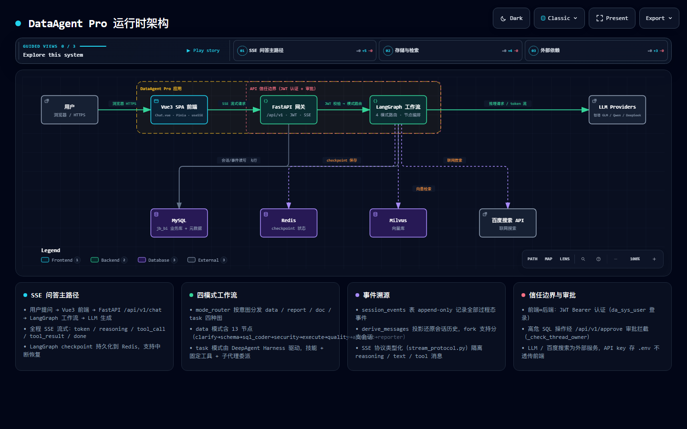
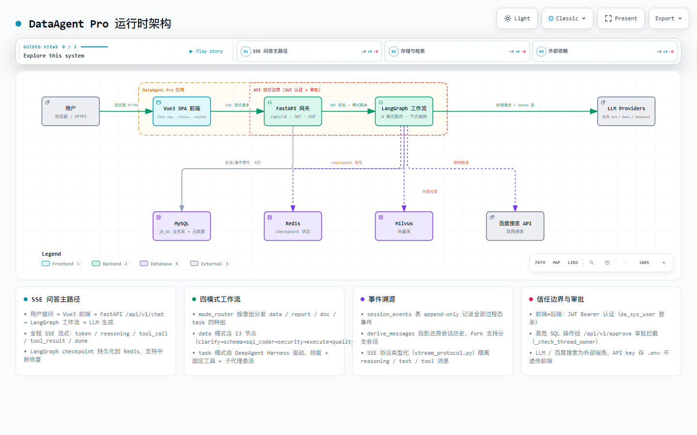
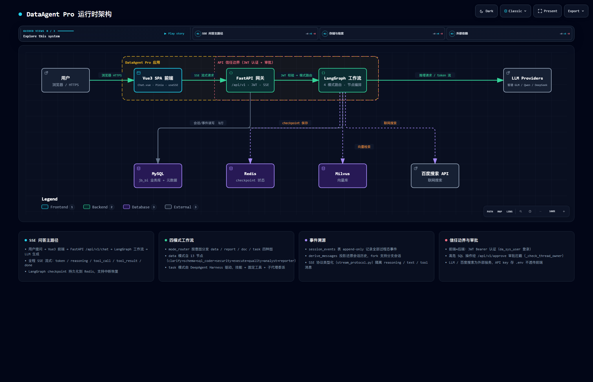
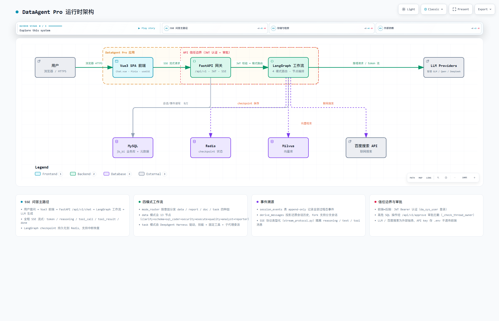

# DataAgent Pro 运行时架构

> 交互式架构图生成：archify v2.15.0
> 数据源：`backend/app/` 源码分析 + `docker-compose.yml`

---

## 架构总览

```json
{
  "nodes": [
    { "id": "user", "label": "用户", "type": "external", "meta": { "role": "外部依赖" } },
    { "id": "frontend", "label": "前端 (Vue3 SPA)", "type": "app", "meta": { "framework": "Vue 3 + Element Plus + ECharts", "port": "5173 (dev)" } },
    { "id": "api", "label": "API 网关 (FastAPI)", "type": "app", "meta": { "framework": "FastAPI (async + SSE)", "port": "8000" } },
    { "id": "workflow", "label": "工作流引擎 (LangGraph)", "type": "app", "meta": { "framework": "LangGraph 1.x", "nodes": "13节点有状态图" } },
    { "id": "llm", "label": "LLM 服务", "type": "external", "meta": { "providers": "Qwen/GLM/DeepSeek", "mode": "私有化部署" } },
    { "id": "mysql", "label": "MySQL", "type": "storage", "meta": { "databases": "jb_bi + jb_bi_meta", "role": "业务数据 + 元数据" } },
    { "id": "redis", "label": "Redis", "type": "storage", "meta": { "role": "状态快照 + 会话缓存" } },
    { "id": "milvus", "label": "Milvus", "type": "storage", "meta": { "role": "向量知识库 (RAG)" } },
    { "id": "search", "label": "百度搜索 API", "type": "external", "meta": { "role": "联网检索" } }
  ],
  "edges": [
    { "from": "user", "to": "frontend", "type": "primary", "label": "HTTP" },
    { "from": "frontend", "to": "api", "type": "primary", "label": "HTTP/SSE" },
    { "from": "api", "to": "workflow", "type": "primary", "label": "调用" },
    { "from": "workflow", "to": "llm", "type": "primary", "label": "LLM请求" },
    { "from": "api", "to": "mysql", "type": "secondary", "label": "会话持久化" },
    { "from": "workflow", "to": "mysql", "type": "secondary", "label": "SQL执行" },
    { "from": "workflow", "to": "redis", "type": "secondary", "label": "Checkpoint" },
    { "from": "workflow", "to": "milvus", "type": "secondary", "label": "向量检索" },
    { "from": "workflow", "to": "search", "type": "secondary", "label": "联网搜索" }
  ]
}
```

---

## 交互式架构图

> 以下嵌入交互式的 archify 运行时架构图，支持多视图切换、主题切换和导出。

<iframe 
  src="/archify/runtime-architecture.html" 
  style="width:100%;height:750px;border:none;border-radius:8px;"
  title="DataAgent Pro 运行时架构交互式图"></iframe>

---

## 关键组件说明

### 1. 前端 (Vue3 SPA)

| 特性 | 说明 |
|------|------|
| 框架 | Vue 3 + Composition API + Vite |
| UI库 | Element Plus + ECharts |
| 状态 | Pinia |
| 通信 | EventSource (SSE) 接收流式响应 |
| 开发端口 | 5173 |

### 2. API 网关 (FastAPI)

| 端点 | 方法 | 说明 |
|------|------|------|
| `/api/v1/chat/completions` | POST | 对话入口（SSE流式返回） |
| `/api/v1/chat/approve` | POST | 管理员审批回调 |
| `/api/v1/chat/stop` | POST | 中断Agent执行 |
| `/api/v1/datasource/list` | GET | 数据源列表 |
| `/api/v1/export/excel` | POST | 文件导出 |

**信任边界**：JWT 认证 + 审批流（`approve.py`）

### 3. 工作流引擎 (LangGraph)

```
clarify_plan → schema → sql_coder → security
       ↓
execute_sql → quality_gate → analyst
       ↓
reporter / answer → finish → Stream Output
       ↓ (写操作)
[中断] → Human Approval → Resume/Reject
```

- **13节点有状态图**：全局状态 `AgentState` 在节点间流转
- **Human-in-the-loop**：基于Redis快照的中断/恢复机制
- **四模式路由**：chat / task / data / agent（`mode_router.py`）

### 4. LLM 服务

| Provider | Model | Base URL |
|----------|-------|----------|
| `qwen-default` | qwen3.6-35b-a3b | 私有化部署 |
| `zhipu-glm4-flash` | glm-4.5-air | `https://open.bigmodel.cn/api/paas/v4` |
| `deepseek` | deepseek-chat | 私有化部署 |

> 通过 `core/llm.py` 的 `MultiProvider` 工厂统一路由

### 5. 存储层

| 组件 | 用途 | 访问方式 |
|------|------|----------|
| MySQL | 业务数据 + 元数据（`jb_bi`, `jb_bi_meta`） | SQLAlchemy ORM |
| Redis | 会话状态快照 + 检查点 | aioredis |
| Milvus | 向量知识库（RAG检索） | pymilvus |
| 百度搜索API | 联网检索能力 | HTTP API |

---

## 主要数据流

### 对话流程（主要路径）

```
用户输入 → Frontend (Chat.vue)
    ↓ HTTP/SSE
FastAPI (chat.py)
    ↓ 路由决策
LangGraph Workflow (workflow.py)
    ↓ LLM调用
外部LLM服务 (Qwen/GLM)
    ↓ 结果返回
FastAPI → SSE流式输出 → Frontend (MessageRenderer.vue)
```

### 数据存储流程

```
会话创建 → FastAPI → MySQL (chat_sessions表)
    ↓
执行过程 → LangGraph → Redis (checkpoint快照)
    ↓
SQL执行 → LangGraph → MySQL (业务库查询)
    ↓
RAG检索 → LangGraph → Milvus (向量相似度检索)
    ↓
事件记录 → LangGraph → MySQL (session_events表)
```

---

## 外部依赖与信任边界

```
┌─────────────────────────────────────────────────────┐
│  外部依赖                                          │
│  ┌──────────┐  ┌──────────┐  ┌──────────────────┐  │
│  │ LLM服务  │  │ 百度搜索 │  │   MySQL/Redis    │  │
│  │ (Qwen    │  │   API    │  │   (外部云服务)   │  │
│  │  GLM)    │  │          │  │                  │  │
│  └──────────┘  └──────────┘  └──────────────────┘  │
└─────────────────────────────────────────────────────┘
           ▲                ▲                ▲
           │                │                │
┌──────────▼────────────────▼────────────────▼──────────┐
│  DataAgent Pro 应用边界（内网隔离）                   │
│  ┌────────────┐    ┌────────────┐    ┌────────────┐  │
│  │  前端SPA   │ ←→ │  FastAPI   │ ←→ │ LangGraph  │  │
│  │  (5173)    │    │  (8000)    │    │  工作流    │  │
│  └────────────┘    └────────────┘    └────────────┘  │
│       ▲                  ▲                ▲          │
│       └──────────────────┴────────────────┘          │
│                    信任边界                          │
│          (JWT认证 + 审批流 + SQL审计)                │
└─────────────────────────────────────────────────────┘
```

---

## 验证截图

多分辨率、双主题渲染验证通过：

| 分辨率 | 暗色主题 | 亮色主题 |
|--------|----------|----------|
| 1440×900 |  |  |
| 2048×1320 |  |  |

> 以上截图使用 archify `visual-check` 功能生成，覆盖主流桌面分辨率和主题。

---

## 图例

| 标记 | 含义 |
|------|------|
| **实线粗箭头** | 主要数据流（用户对话路径） |
| **虚线细箭头** | 次要数据流（存储、搜索等） |
| **橙色虚线框** | DataAgent Pro 应用边界 |
| **红色虚线框** | API 信任边界（JWT认证+审批） |
| **绿色节点** | 内部组件 |
| **灰色节点** | 外部依赖 |

---

## 文件位置

| 资源 | 路径 |
|------|------|
| 架构图 JSON | `assets/archify/runtime-architecture.json` |
| 交互HTML | `docs/.vitepress/public/archify/runtime-architecture.html` |
| 验证截图 | `docs/.vitepress/public/archify/checkpoints/` |
| 源码分析 | `backend/app/main.py`, `backend/app/graph/`, `backend/app/core/llm.py` |

---

## 生成说明

使用 **archify** 工具生成：

```bash
# 生成架构图
node ~/.codebuddy/skills/archify/bin/archify.mjs generate \
  --input assets/archify/runtime-architecture.json \
  --output assets/archify/runtime-architecture.html

# 视觉检查
node ~/.codebuddy/skills/archify/bin/archify.mjs visual-check \
  --input assets/archify/runtime-architecture.json \
  --resolutions 1440x900,2048x1320
```

- Schema 版本：`archify/architecture/2026/02`
- 节点数：9 | 边数：9 | 区域数：2 | 卡片数：4
